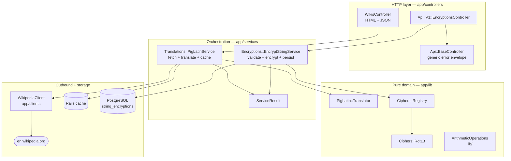
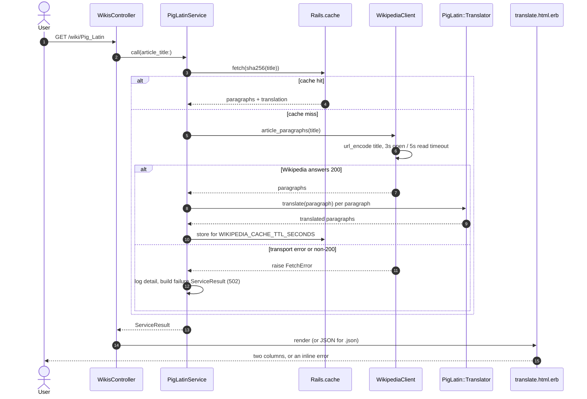

# Fund That Flip — Ruby on Rails assessment

A three-part Rails take-home. It exposes a JSON endpoint that ROT13-encrypts a string
and records it, a web page that fetches a Wikipedia article and renders it beside a
Pig Latin translation, and a small library that implements integer `multiply` and
`power` from addition alone. There is no login, no user model and no background
worker — the whole app is three features and the plumbing they need.

## Screenshots

Captured with Playwright at 1440x900 against `bin/rails server` (on port 8710 here, 3000
by default); [`docs/capture_api.sh`](docs/capture_api.sh) regenerates the text captures.

**Article and translation, side by side** — `/wiki/Pig_Latin`. The article documents
its own expected output (`"she does not know"` → `"eshay oesday otnay owknay"`), which
the right-hand column reproduces exactly.


**A longer article** — `/wiki/Ruby_(programming_language)`.


**A title Wikipedia does not have** — the failure is inline and says nothing about
internal URLs or exception classes.


### Captured output

Full transcripts live in [`docs/output/`](docs/output). Abridged:

```
$ curl -i -X POST $HOST/api/v1/encryptions/rot13 -d {"original_string":"Hello, World!"}
HTTP/1.1 200 OK
Content-Type: application/json; charset=utf-8

{"original_string":"Hello, World!","encrypted_string":"Uryyb, Jbeyq!","error":null}

$ ... -d {"original_string":12345}     # non-string: refused, nothing internal leaked
HTTP/1.1 422 Unprocessable Entity
Content-Type: application/json; charset=utf-8

{"original_string":null,"encrypted_string":null,"error":"Missing parameter or its value: original_string"}
```

Article cache, cold versus warm (`docs/output/cache-timing.txt`, same article five times
after a server restart):

```
request         bytes    seconds
#1              52500   3.186100
#2              52500   0.006994
#3              52500   0.006712
#4              52500   0.007131
#5              52500   0.006668
```

## Architecture

Four layers, dependencies pointing inward. Nothing in `app/lib` knows about Rails,
HTTP or the database, which is why it is the part with the densest tests.



## Workflow

The translation request, which is the only flow with more than one moving part.



## Quickstart

```bash
# Ruby 3.1.3 and a running PostgreSQL are the only prerequisites.
bundle install
bin/rails db:prepare
bin/rails server            # http://localhost:3000
```

Then open <http://localhost:3000>, type an article title, and press Translate.

With Docker instead:

```bash
echo "SECRET_KEY_BASE=$(bin/rails secret)" > .env   # compose reads .env; it is gitignored
docker compose up --build                            # http://localhost:8710
```

## Configuration

Every variable the app reads. All are optional in development; `SECRET_KEY_BASE` and
`DATABASE_URL` are required in production.

| Name | Required | Default | Purpose |
| --- | --- | --- | --- |
| `DATABASE_URL` | production | from `config/database.yml` | PostgreSQL connection string. Overrides the YAML when set. |
| `FTF_ASSESSMENT_DATABASE_PASSWORD` | production (if not using `DATABASE_URL`) | none | Password for the `ftf_assessment` production role. |
| `SECRET_KEY_BASE` | production | none | Rails signing key. `docker compose` refuses to start without it. |
| `RAILS_MAX_THREADS` | no | `5` | Puma threads and the ActiveRecord pool size. |
| `RAILS_SERVE_STATIC_FILES` | no | unset | Serve `public/` from Rails; set in the container image. |
| `RAILS_LOG_TO_STDOUT` | no | unset | Log to stdout instead of `log/production.log`. |
| `RAILS_FORCE_SSL` | no | unset | Redirect to HTTPS and set HSTS in production. |
| `WIKIPEDIA_BASE_URL` | no | `https://en.wikipedia.org/wiki/` | Article source. Point at a mirror to work offline. |
| `WIKIPEDIA_OPEN_TIMEOUT` | no | `3` | Seconds to wait for the TCP/TLS handshake. |
| `WIKIPEDIA_READ_TIMEOUT` | no | `5` | Seconds to wait for the article body. |
| `WIKIPEDIA_CACHE_TTL_SECONDS` | no | `3600` | How long a fetched + translated article is reused. |
| `MAX_ENCRYPTION_BYTES` | no | `1048576` | Ceiling on the ROT13 request body read. |
| `CACHE_SIZE_BYTES` | no | `67108864` | Production in-process cache size. |
| `POSTGRES_PASSWORD` | no | `ftf_assessment_dev` | Compose-only: password for the bundled `db` service. |

## Development

```bash
bundle exec rspec                   # 101 examples; no network, no fixtures required
bundle exec rubocop                 # 53 files, zero offences
bundle exec rake benchmark:arithmetic
docs/capture_api.sh                 # regenerate docs/output/ against a running server
```

The suite blocks outbound HTTP via WebMock, so it runs on a plane. It needs a
PostgreSQL the `test` entry in `config/database.yml` can reach; `bin/rails db:prepare`
creates it.

### API

```
POST /api/v1/encryptions/rot13
Content-Type: application/json
{"original_string": "Hello, World!"}

200 {"original_string":"Hello, World!","encrypted_string":"Uryyb, Jbeyq!","error":null}
422 {"original_string":null,"encrypted_string":null,"error":"Missing parameter or its value: original_string"}
500 {"error":"Something went wrong. Please try again."}
```

```
GET /wiki/:title           HTML, two columns
GET /wiki?wiki_url=:title  same action, used by the on-page form
GET /wiki/:title.json      {original_paragraphs, translated_paragraphs, original_content, translated_content, error_message}
GET /up                    liveness probe: 200 "ok", no database, no network
```

`ftf_assessment.postman_collection.json` holds the same requests.

## Project structure

```
app/
  lib/                       pure domain — no Rails, no I/O, no database
    ciphers/rot13.rb         the ROT13 transform itself
    ciphers/registry.rb      name -> cipher lookup; the extension seam
    pig_latin/translator.rb  the Pig Latin rules
  clients/
    wikipedia_client.rb      the only code that opens a socket
  services/
    application_service.rb   .call convenience base
    service_result.rb        success/failure + status, returned by every service
    encryptions/             validate -> encrypt -> persist
    translations/            fetch -> translate -> cache
  controllers/
    api/base_controller.rb   JSON error envelope, nothing leaked
    api/v1/                  versioned API
    wikis_controller.rb      HTML + JSON for the translator
  models/string_encryption.rb
  views/wikis/translate.html.erb
lib/
  arithmetic_operations.rb   multiply and power from addition alone
  tasks/benchmark.rake       the benchmark quoted in this README
spec/                        mirrors app/ one-for-one, plus spec/requests
docs/
  capture_api.sh             regenerates everything in docs/output
  output/                    real transcripts and timings
  screenshots/
```

## Design notes

**Why four layers for an app this small.** The original code put the URL building,
the HTTP call, the HTML parsing, the translation rules and the result shaping inside
one service object, and the exception policy inside `ApplicationController`. That is
fine until you want to test the Pig Latin rules, at which point you either stub
`Net::HTTP` or hit Wikipedia for real — the original suite did the latter, which is
why it took 7.2s and needed a network. Splitting the rules into `app/lib` made them
testable in microseconds and made the punctuation bugs below findable.

**`ServiceResult` instead of `[hash, {status:}]`.** Services used to return a
two-element array that callers indexed positionally (`resp[0]`, `resp[1][:status]`).
Success and failure were indistinguishable at the call site. `ServiceResult` is frozen,
answers `success?`, and carries the HTTP status the controller should use.

**The real bottleneck was the network, not the database.** One table, one insert per
API call, one index. Nothing reads it. The expensive path is `/wiki/:title`: an HTTPS
round trip to Wikipedia plus a word-by-word translation of a 50 KB article, repeated
in full on every request. Caching the *pair* — article and translation, keyed by a
digest of the normalised title — takes a repeat request from **3.19s to 0.0067s**
(`docs/output/cache-timing.txt`). Failures are deliberately not cached, so a transient
Wikipedia outage does not pin an error page for an hour. The fetch now carries a 3s
open and 5s read timeout; previously it had neither, so one slow upstream could hold a
Puma thread for the full 60s default.

**The second bottleneck was algorithmic.** `multiply` was repeated addition, so its
cost was linear in the *value* of the second operand: `multiply(2, 10_000_000)` did ten
million additions and `multiply(10_000_000, 2)` did two, for the same product.
Shift-and-add makes it logarithmic, and exponentiation by squaring does the same for
`power`. Measured with `bundle exec rake benchmark:arithmetic`:

```
case                           repeated-add  shift-and-add    speedup
----------------------------------------------------------------------
multiply(2, 1_000_000)            0.037398s      0.000018s      2078x
multiply(2, 10_000_000)           0.380346s      0.000011s     34577x
multiply(123_456, 98_765)         0.003709s      0.000007s       530x
power(2, 64)                      0.000021s      0.000016s         1x

ruby 3.1.3 on arm64-darwin23
```

**The extension seam is the cipher registry.** `enc_type` was already a free-text
column, so the schema was always ready for more than one cipher. `Ciphers::Registry`
makes that explicit: a new cipher is one module responding to `.encrypt` plus one
`register` line, and neither the controller, the service, the model nor a migration
changes. `spec/lib/ciphers/registry_spec.rb` asserts exactly that by registering an
Atbash cipher at runtime. `WikipediaClient` is the second seam — inject any object
responding to `article_paragraphs` and the translator works against a different source.

**Error handling is format-aware.** `ApplicationController` used to
`rescue_from StandardError` and render `{"error": "Could not create record: #{message}"}`
for everything, including HTML page requests. Now the JSON API has its own base
controller with a generic envelope and a logged detail, and the HTML side lets Rails
render the right thing for the format.

## Limitations

- **The cache is in-process.** `:memory_store` means each Puma worker or container has
  its own copy, so the hit rate on an N-process deploy is roughly 1/N. Point
  `config.cache_store` at Memcached or Redis before scaling out.
- **`string_encryptions` only grows.** One row per API call, nothing ever reads or
  prunes it. A retention job or a partition by `created_at` is the obvious next step;
  neither is in scope for the brief.
- **Wikipedia is scraped, not queried through its API.** `Nokogiri.css('p')` picks up
  every paragraph on the page, including edit notices and navigation prose. The action
  API would give cleaner extracts; scraping is what the brief describes.
- **`multiply` and `power` are integer-only** and raise `TypeError` on anything else,
  and `power` raises `ArgumentError` on a negative exponent rather than inventing a
  fractional answer. They are a library, not an endpoint; nothing in the web app calls
  them.
- **Pig Latin has no single correct specification.** This implementation treats a
  non-initial `y` as a vowel (`syllable` → `yllablesay`) and preserves leading and
  trailing punctuation in place. Both are defensible choices, not the only ones.
- **`config/credentials.yml.enc` is committed without its `master.key`**, which is
  correctly gitignored. Nothing in the app reads the credentials; production uses
  `SECRET_KEY_BASE` instead. A fresh clone cannot run `rails credentials:edit`.
- **No authentication, no rate limiting.** Both endpoints are open. The ROT13 endpoint
  caps the body it reads at 1 MB, but nothing caps the request *rate*.
