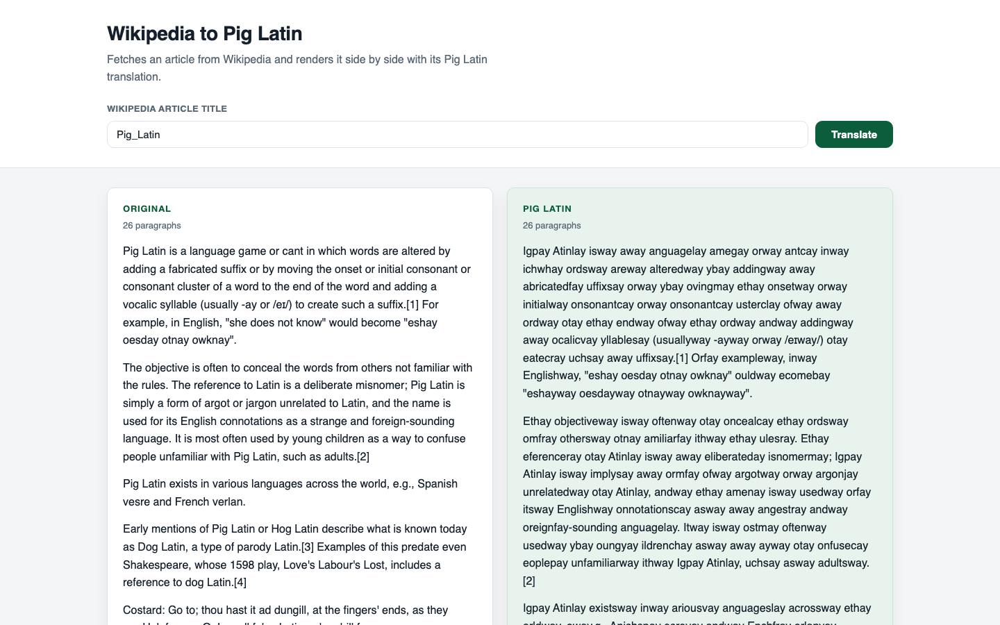
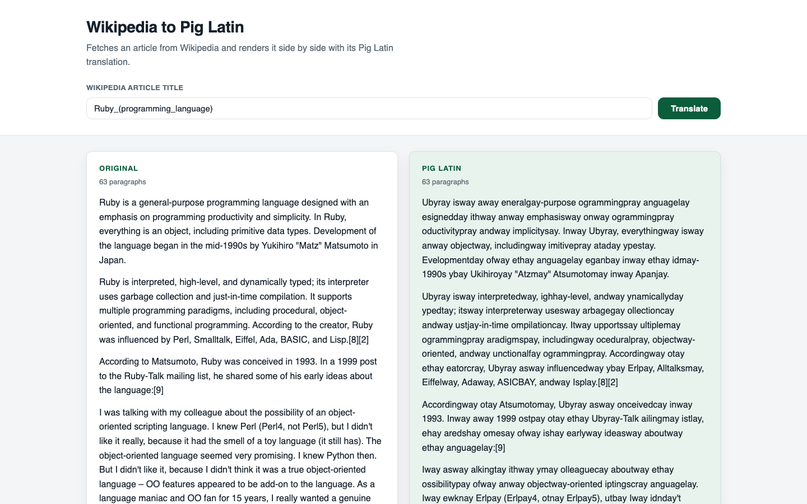
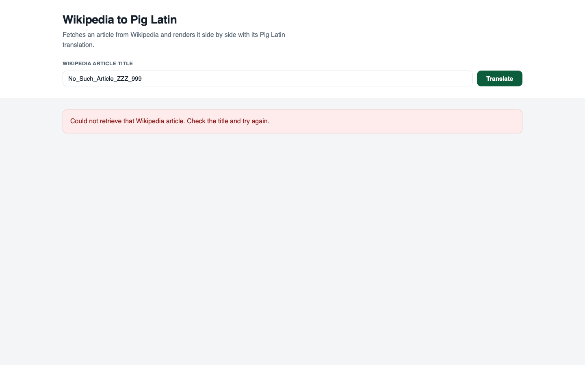
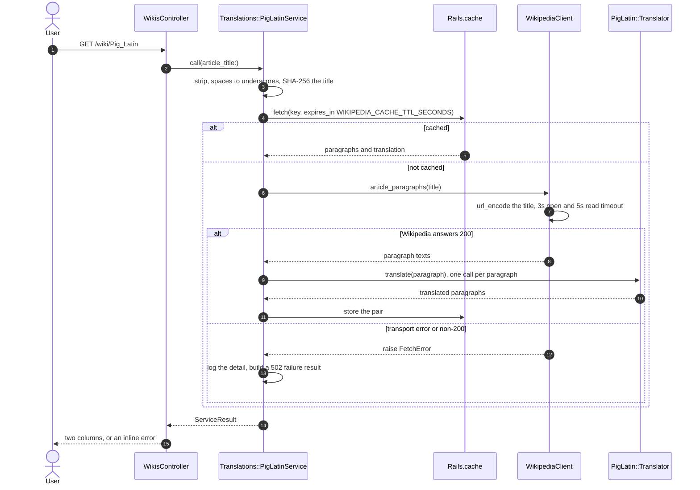

# Pig Latin, ROT13, and multiplication without `*`

A Rails 7.0 assessment built around three unrelated exercises: a JSON endpoint that
ROT13-encrypts a string and records the pair in PostgreSQL, a page that fetches a
Wikipedia article and renders it beside a Pig Latin translation, and a library that
implements integer `multiply` and `power` from addition alone. No login, no user model,
no background worker.

`ftf` is initials. They survive as the Rails module name (`FtfAssessment`), the database
names and `FTF_ASSESSMENT_DATABASE_PASSWORD`, and nothing in the code depends on what
they stand for.

## The three exercises

| Exercise | Where it lives | How to see it |
| --- | --- | --- |
| ROT13 a string, persist original + encrypted | `app/lib/ciphers/`, `app/services/encryptions/`, `app/controllers/api/v1/` | `POST /api/v1/encryptions/rot13` |
| Wikipedia article beside its Pig Latin translation | `app/lib/pig_latin/`, `app/clients/`, `app/services/translations/` | `GET /wiki/Pig_Latin` |
| `multiply` and `power` with no `*` and no `**` | `lib/arithmetic_operations.rb` | `bundle exec rake benchmark:arithmetic` |

The layering is the same in all three. `app/lib` is plain Ruby — no Rails, no I/O, no
database — which is why it carries the densest tests. `app/clients` holds the only class
that opens a socket. `app/services` orchestrates and returns a `ServiceResult` (frozen,
answers `success?`, carries the HTTP status). Controllers do HTTP and nothing else.
`spec/` mirrors that tree directory for directory.

## The page

Captured at 1440x900 against `bin/rails server`. `docs/capture_api.sh` regenerates the
text captures in [`docs/output/`](docs/output).

`/wiki/Pig_Latin`, 26 paragraphs each side. The article states its own expected output —
`"she does not know"` becomes `"eshay oesday otnay owknay"` — and the right-hand column
reproduces that phrase exactly, punctuation and quotes in place.



`/wiki/Ruby_(programming_language)`, a longer article at 63 paragraphs. A title with
parentheses is URL-encoded before it reaches Wikipedia.



A title Wikipedia does not have. The failure is inline and mentions no URL, exception
class or status code.



## What happens on GET /wiki/:title

The only flow in the app with more than one moving part.



The expensive part is the round trip plus a word-by-word pass over a 50 KB article, and
both are deterministic for a given title, so the *pair* is cached together. Failures are
never cached — `Rails.cache.fetch` only stores the block's value, and a failed fetch
raises out of the block — so a transient outage cannot pin an error page for an hour.
Measured on the same article five times after a server restart
([`docs/output/cache-timing.txt`](docs/output/cache-timing.txt)):

```
request         bytes    seconds
#1              52500   3.186100    cold
#2              52500   0.006994
#5              52500   0.006668
```

The client's 3s open and 5s read timeouts bound a request at 8 seconds rather than the
60 + 60 that `Net::HTTP` defaults to, and `WikipediaClient::TRANSPORT_ERRORS` collapses
DNS, TLS, refused-connection and timeout failures into one `FetchError` for callers.

## Running it

```bash
# Ruby 3.1.3 and a running PostgreSQL are the only prerequisites.
bundle install
bin/rails db:prepare
bin/rails server            # http://localhost:3000
```

Open <http://localhost:3000>, type an article title, press Translate.

```bash
bundle exec rspec                       # 101 examples, 0 failures
bundle exec rubocop                     # 53 files inspected, no offenses detected
bundle exec rake benchmark:arithmetic
docs/capture_api.sh                     # regenerates docs/output against a running server
```

`spec/rails_helper.rb` calls `WebMock.disable_net_connect!(allow_localhost: false)`
before every example, so no test can reach the network. The suite does need a PostgreSQL
that the `test` entry in `config/database.yml` can reach — `bin/rails db:prepare` creates
it.

With Docker instead:

```bash
echo "SECRET_KEY_BASE=$(bin/rails secret)" > .env   # compose reads .env, which is gitignored
docker compose up --build                            # http://localhost:8710
```

## The API

```
POST /api/v1/encryptions/rot13
Content-Type: application/json
{"original_string": "Hello, World!"}

200 {"original_string":"Hello, World!","encrypted_string":"Uryyb, Jbeyq!","error":null}
422 {"original_string":null,"encrypted_string":null,"error":"Missing parameter or its value: original_string"}
500 {"error":"Something went wrong. Please try again."}
```

```
GET /wiki/:title           HTML, two columns
GET /wiki?wiki_url=:title  same action, the target of the on-page form
GET /wiki/:title.json      {original_paragraphs, translated_paragraphs, original_content, translated_content, error_message}
GET /up                    liveness probe: 200 "ok", no database, no network
```

Non-string, empty, malformed and oversized bodies all come back as a 422 with a
user-facing message. The exception detail goes to the log and never into the response —
`Api::BaseController` renders one generic envelope for anything that escapes. The HTML
side installs no blanket `rescue_from` at all and lets Rails render the right thing for
the format. Real request and response pairs for every case are in
[`docs/output/api-transcript.txt`](docs/output/api-transcript.txt), and
`ftf_assessment.postman_collection.json` holds the same requests.

## Environment

Everything the app reads. All optional in development. `SECRET_KEY_BASE` and a database
URL or password are required in production.

| Name | Default | Purpose |
| --- | --- | --- |
| `DATABASE_URL` | from `config/database.yml` | PostgreSQL connection string. Overrides the YAML when set. |
| `FTF_ASSESSMENT_DATABASE_PASSWORD` | none | Password for the `ftf_assessment` production role. |
| `SECRET_KEY_BASE` | none | Rails signing key. `docker compose` refuses to start without it. |
| `RAILS_MAX_THREADS` | `5` | Puma threads and the ActiveRecord pool size. |
| `RAILS_SERVE_STATIC_FILES` | unset | Serve `public/` from Rails. Set in the container image. |
| `RAILS_LOG_TO_STDOUT` | unset | Log to stdout instead of `log/production.log`. |
| `RAILS_FORCE_SSL` | unset | Redirect to HTTPS and set HSTS in production. |
| `WIKIPEDIA_BASE_URL` | `https://en.wikipedia.org/wiki/` | Article source. Point it at a mirror to work offline. |
| `WIKIPEDIA_OPEN_TIMEOUT` | `3` | Seconds to wait for the TCP/TLS handshake. |
| `WIKIPEDIA_READ_TIMEOUT` | `5` | Seconds to wait for the article body. |
| `WIKIPEDIA_CACHE_TTL_SECONDS` | `3600` | How long a fetched and translated article is reused. |
| `MAX_ENCRYPTION_BYTES` | `1048576` | Ceiling on the ROT13 request body read. |
| `CACHE_SIZE_BYTES` | `67108864` | Production in-process cache size. |
| `POSTGRES_PASSWORD` | `ftf_assessment_dev` | Compose only: password for the bundled `db` service. |

## Judgement calls

**Pig Latin has no canonical specification**, so the rules this implementation picks are
spelled out at the top of `app/lib/pig_latin/translator.rb` and pinned by
`spec/lib/pig_latin/translator_spec.rb`. A non-initial `y` counts as a vowel
(`syllable` → `yllablesay`). Leading and trailing non-letters stay put, so `know"`
becomes `owknay"` rather than `ow"knay`. A token with no letters at all is returned
untouched. The original word's capitalisation shape is carried over. All four are
defensible choices, not the only ones.

**The extension seam is the cipher registry.** `enc_type` is a free-text column, so the
schema was always ready for more than one cipher. `Ciphers::Registry` makes that
explicit: a new cipher is one module responding to `.encrypt` plus one `register` line,
and neither the controller, the service, the model nor a migration changes.
`spec/lib/ciphers/registry_spec.rb` asserts exactly that by registering an Atbash cipher
at runtime and encrypting with it. `WikipediaClient` is the second seam — inject any
object answering `article_paragraphs` and the translator works against a different
source.

**The no-`*` constraint does not have to cost you a linear loop.** Repeated addition is
correct but linear in the *value* of an operand, so `multiply(2, 10_000_000)` does ten
million additions while `multiply(10_000_000, 2)` does two for the same product.
`ArithmeticOperations` uses Russian-peasant shift-and-add and exponentiation by squaring
instead — both logarithmic, both built from `+`, integer halving and bit tests, so the
constraint still holds. `lib/tasks/benchmark.rake` keeps a repeated-addition baseline
alongside the current implementation, checks the two agree on every case, and times them
([`docs/output/arithmetic-benchmark.txt`](docs/output/arithmetic-benchmark.txt)):

```
case                           repeated-add  shift-and-add    speedup
multiply(2, 1_000_000)            0.037398s      0.000018s      2078x
multiply(2, 10_000_000)           0.380346s      0.000011s     34577x
multiply(123_456, 98_765)         0.003709s      0.000007s       530x
power(2, 64)                      0.000021s      0.000016s         1x
```

## Known gaps

- **The cache is in-process.** `:memory_store` gives each Puma worker its own copy, so
  the hit rate on an N-process deploy is roughly 1/N. Point `config.cache_store` at
  Memcached or Redis before scaling out.
- **`string_encryptions` only grows.** One row per API call, and nothing reads or prunes
  it. A retention job or a partition on `created_at` is the obvious next step.
- **Wikipedia is scraped, not queried through its API.** `Nokogiri.css('p')` picks up
  every paragraph on the page, edit notices and navigation prose included. The action API
  would give cleaner extracts, but scraping is what the exercise describes.
- **`multiply` and `power` are integer-only.** Both raise `TypeError` on anything else,
  and `power` raises `ArgumentError` on a negative exponent rather than inventing a
  fractional answer. They are a library — nothing in the web app calls them.
- **No authentication and no rate limiting.** Both endpoints are open. The ROT13 endpoint
  caps the body it reads at 1 MB, but nothing caps the request *rate*.
- **`config/credentials.yml.enc` is committed without its `master.key`**, which is
  correctly gitignored and absent. Nothing in the app reads the credentials and
  production uses `SECRET_KEY_BASE`, but a fresh clone cannot run `rails credentials:edit`.
- **The Docker image has not been built or booted** from this checkout. The `Dockerfile`
  and `docker-compose.yml` are committed and reviewable, but unexercised.
